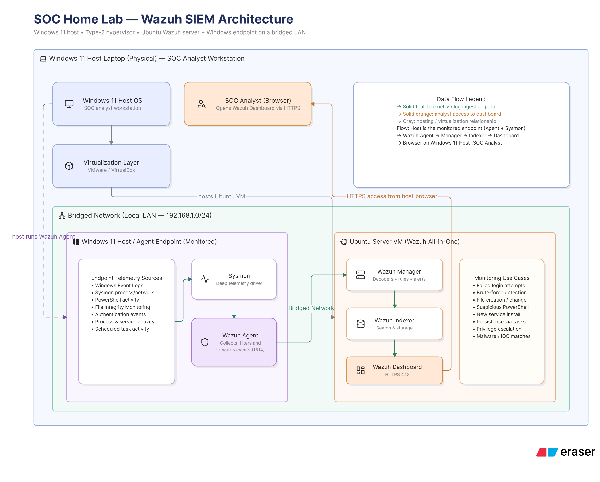

# ARCHITECTURE

This architecture was designed with the available hardware resources in mind. While the setup can be expanded depending on the capabilities of the host machine, this configuration provides a practical and resource-efficient environment for my home SOC lab.

The Wazuh Server is hosted on an Ubuntu 22.04 LTS virtual machine. The Ubuntu VM runs the core Wazuh components, including the Wazuh Manager, Wazuh Indexer, and Wazuh Dashboard, allowing the three components to work together as a centralized security monitoring platform.

Instead of deploying another virtual machine to serve as an endpoint, my Windows 11 host machine acts as the Wazuh agent. This decision was primarily based on the limitations of my hardware, particularly the 8 GB of available RAM. Running multiple virtual machines simultaneously would place significant resource demands on the host and could negatively affect the performance and stability of the lab. Using the host machine as the monitored endpoint allows me to dedicate the available virtual machine resources to the Wazuh infrastructure while still having a functional endpoint to generate security telemetry.

The Windows 11 host is monitored through the Wazuh Agent, which collects security-related information such as Windows event logs, authentication events, PowerShell activity, file integrity changes, and other endpoint activities. This provides sufficient telemetry for conducting security monitoring and detection exercises without requiring an additional Windows virtual machine.

The Bridged Network configuration was also intentionally selected. Rather than isolating the Ubuntu VM behind a virtual NAT network, bridged networking places the Wazuh server and the Windows host on the same local network. This allows the Windows host to communicate directly with the Wazuh server using its network IP address and provides a more realistic representation of a small-scale internal corporate network.

The setup can therefore be viewed as a simplified representation of an organization's security monitoring environment:

Windows Endpoint → Wazuh Agent → Wazuh Manager → Wazuh Indexer → Wazuh Dashboard → Security Analyst

Although this architecture is smaller than a production SOC environment, it provides a practical environment for learning SIEM administration, endpoint monitoring, log analysis, File Integrity Monitoring, authentication monitoring, PowerShell activity analysis, Sysmon-based telemetry, and security event investigation.

Most importantly, the architecture prioritizes functionality and learning within hardware constraints. Rather than attempting to reproduce a large enterprise environment that my current machine cannot comfortably support, I chose a smaller architecture that allows me to actively experiment with the system, generate security events, investigate them through Wazuh, and gradually expand the lab as additional resources become available.

