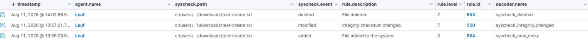
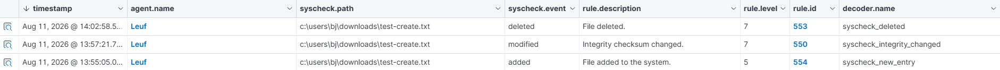

# FIM DETECTION

## Objective
Detect creation, modification and deletion of files within the Windows Download Directory

## Configuration
```xml
<syscheck>
    <disabled>no</disabled>
    <frequency>43200</frequency>
    <directories realtime="yes" whodata="yes">C:\Users\<USER>\Downloads</directories>
<syscheck>
```

## Test
A controlled test files were created:
One test was added via GUI:
wazuh-live-test.txt

One test was added via Powershell:
test-create.txt

The file was subsequently modified and deleted.

Commands used via Powershell:
```powershell
"Created by Wazuh lab" | Out-File "$env:USERPROFILE\Downloads\test-create.txt"
"Modified by Wazuh lab" | Out-File "$env:USERPROFILE\Downloads\test-create.txt" -Append
Remove-Item "$env:USERPROFILE\Downloads\test-create.txt"
```

## Detection
Wazuh generated:
For Adding:
- Rule ID: 554
- Description: File added to the system
- Syscheck decoder: syscheck_new_entry
- Level: 5

For Modifying:
- Rule ID: 550
- Description: File checksum changed
- Syscheck decoder: syscheck_integrity_changed
- Level: 7

For Deleting:
- Rule ID: 553
- Description: File Deleted
- Syscheck decode: syscheck_deleted
- Level: 7

## Evidence



## Investigation
The alert was investigated through the Wazuh Dashboard and the underlying Wazuh alert logs to confirm Wazuh Indexer connectivity.

## Result
The Wazuh agent successfully detected the file deletion and forwarded the event to the Wazuh Manager and Dashboard.

## Lessons Learned
FIM can provide visibility into file activity and when whoidata is enabled, can provide additional context about the user and process associated with the modification. Ultimately, FIM can be used to monitor attacks for example attacks that uses .bat which utilizes a script to be run inside the Command Prompt or Powershell in which creates, modifies, deletes files in a specific directory but in a more practical sense, the monitoring should be global to see attacks such as this wherein malware supposedly installs/creates in a specific directory and then modifies the files and then delete it after as part of its batch script.