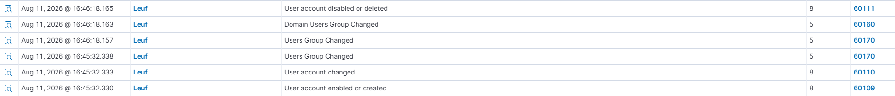

# NEW LOCAL USER

## Objective
The goal is to exercise account management in this scenario as a SOC Analyst. 

## Detection
To verify that the user was indeed reflected both in the dashboard and in the agent side, we run these commands in the Powershell:

To create an account:
net user soc-test "LabPassword123!" /add

To check if it reflected in the machine:
net user soc-test "LabPassword123!" /add

We should be able to see the user "soc-test" displayed back to us with a default belonging to the group "Guest"

To delete the account: 
net user soc-test /delete

## Result
In Wazuh Dashboard,

upon User Creation:
- Rule ID: 60109
- Description: User account enabled or created 
- Level: 8

upon User Change:
- Rule ID: 60110
- Description: User account changed
- Level: 8

upon User Group Change:
- Rule ID: 60170
- Description: User Group Changed
- Level: 5

upon Domain Users Group Change:
- Rule ID: 60160
- Description: Domain Users Group Changed
- Level: 5

upon User Deletion:
- Rule ID: 60111
- Description: User account disabled or deleted
- Level: 8

To briefly explain what these mean, upon user creation, the logs showe that there were a change with regards to the user because we set a password and it logged that as well hence the reflected log in the dashboard. The created user is assigned a group (Guest) that is why the user group changed. Upon deletion, there was a log that the Domain Users Group Changed, this was due to the fact that there are no more accounts in the "Guest" group so Windows has to adjust removing the account of its membership to a certain group

## Evidence

## Lessons Learned
I learned that we can also use SIEMs to closely monitor account management. I can track some behavioral patterns one may have when managing accounts and base a diagnosis off of the fact that there are unusual tendencies the logs may or may not inherit. A distinct pattern recognition should help me recognize what is unusual and what is not.