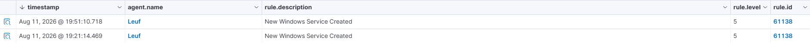

# Service Telemetry

## Objective
The goal of this exercise is to observe security telemetry with regards to user created services and to observe how an attacker can persist their way back to your system something like a backdoor

## Prerequisite
Try to download Sysmon as to try to double check the SIEM logs as well as the logs of the agent and try to cross reference them.

## Detection
Create your custom service. I created a custom service which just simply opens Notepad
```powershell
sc.exe create WazuhLabService binPath= "C:\Windows\System32\notepad.exe"
```

Check whether or not it exists
```powershell
sc.exe create WazuhLabService binPath= "C:\Windows\System32\notepad.exe"
```

Then delete it
```powershell
sc.exe create WazuhLabService binPath= "C:\Windows\System32\notepad.exe"
```

## Result
The logs show that there are newly made services.
- Rule ID: 61138
- Description: New Window Service Created
- Level: 5 

Now, this sort of pattern can be a tactic used by attackers to have persistence to the already compromised machine. Persistence in this context is like the attacker left a back door to your machine in the form of a malicious service allowing the attacker to go back in the compromised machine to do whatever needs to be done. 



## Lesson Learned
Notice that there are two logs of a created service because I double-checked whether or not deleting a user-made service is being logged by the SIEM, the SIEM does not log when we delete a user-made service. Taking note of this, upon some research, I learned that I can create a custom rule to monitor deletion of these said user-made services. This is worth taking note of because there might be a way to look at an unusual service which was created by a specific user and to check if the service is still there and maybe isolate that specific service in a sandbox. Just a little scenario to think about.