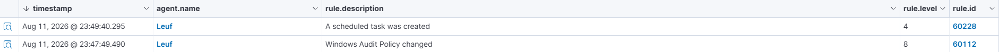

# SCHEDULED TASK

## Objective
Similar to 05-new-service.md exercise, this goal is to observe patterns in such a way to recognize how an attacker can persist their way through a "harmless" scheduled task that at first glance may seem like nothing but the attacker left a way to get back inside the system.

## Configuration
Add this in the configuration to ensure that the server can perform telemetry on scheduled event. Put it inside the xml tag <localfile>
```xml
<location>Microsoft-Windows-TaskScheduler/Operational</location>
```

I also researched a bit about how I can ensure that I can trace the scheduled task so I came upon this command which allows me to track whether the task exists.

Firstly, I adjusted my own audit setting with this command to enable Windows to generate security events that I want to monitor inside the Wazuh Dashboard

Check if Other Object Access Events is turned off, we must turn it on.
```powershell
auditpol /get /subcategory:"Other Object Access Events"
```

If it is off, turn it auditing on with this command
```powershell
auditpol /set /subcategory:"Other Object Access Events" /success:enable
```

## Detection
First, create the scheduled event with this command in the Powershell
schtasks /create /tn "WazuhLabTest" /tr "notepad.exe" /sc once /st 23:59

Check it in Wazuh and see if it reflects in the Windows Security Events, use this command to verify its existence
```powershell
Get-WinEvent -FilterHashtable @{LogName='Security'; Id=4698} -MaxEvents 5 |
    Select-Object TimeCreated, Id, Message |
    Format-List
```

Then delete it
```powershell
schtasks /delete /tn "WazuhLabTest" /f
```

Again, verify that the Window Security Events made the corresponding log
```powershell
Get-WinEvent -FilterHashtable @{LogName='Security'; Id=4699} -MaxEvents 5 |
    Select-Object TimeCreated, Id, Message |
    Format-List
```

## Result
Much like the 05-new-service.md exercise, this handles a persistence issue that an attacker may utilize as well. After the right configuration was done, the logs showed that there was a scheduled task that was created. Similar to the last exercise, the same pattern can be applied to this and past learning experience can be applied to this as well.

- Rule ID: 60228
- Description: A scheduled task was created
- Level: 5

## Evidence


## Lessons Learned
I learned a lot in this exercise, mostly because there are a lot of ways to configure what you want to monitor inside the Configuration File of Wazuh. I encountered manually entering the command and having to know why Wazuh is not reflecting the command and also had to research on how I can track the events. Once I knew the right configuration for the test, the test was able to be completed. The scheduled service was created and it is such a learning experience because an attacker can slip right through and have a somewhat of a backdoor inside the compromised system with that specific scheduled service so making sure that there is telemetry with types of attacks is very important as well.


