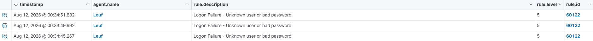

# MULTIPLE FAILED ATTEMPTS

## Objective
The goal of this exercise is to observe the pattern of a brute-force attack

## Detection
First, to replicate a failed login, use the command "runas" in Powershell as it is the easiest way to replicate a logon prompt as if we are signing in to a machine with valid credentials.
```powershell
runas /user:%USERNAME% cmd
```

Enter the password incorrectly and observe the response. It should respond as follows:
```powershell
RUNAS ERROR: Unable to run - cmd
1326: The user name or password is incorrect.
```

## Result
This attack pattern can very well just be a brute force attack, if we do not have the right guardrails to defend against this type of attack then a powerful enough computer can break this with just time. Though it has an alert level of 5, we must not for a second let down our guard.

- Rule ID: 60122
- Description: Logon Failure - Unknown User or Bad Password
- Level: 5

## Evidence


## Lessons Learned
This might be the easiest to do but is also the easiest to overlook. The lessons I have learned is that, since most of the time, I do not see the user logging in into a machine, I can for sure see myself overlooking this and setting it aside and just assuming for the best that the user just forgot their password but as a SOC Analyst, I must not let my guard down even for these types of alerts, though it has an alert level 5, this may just as well be a pattern for a brute-force attack and noticing this as early as this can be kind of misleading but the right approach to investigating these brute-force attacks are pattern recognition on how fast, frequent the attempts are. 